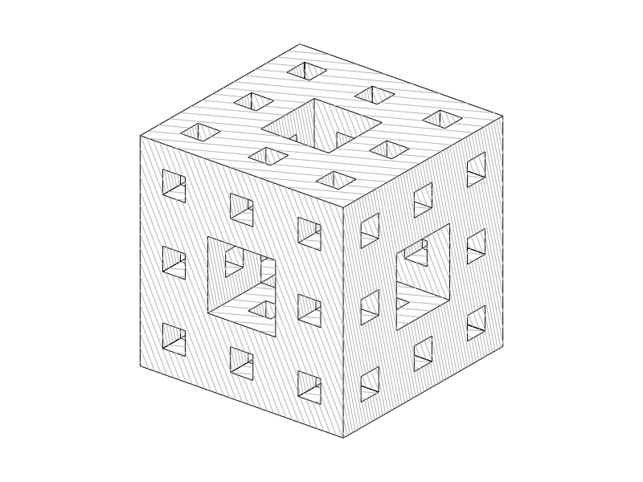

# line_gl

A C++17 hidden-line renderer that produces clean SVG output suitable for pen plotting. Scenes are defined in JSON and rendered by projecting 3D geometry, removing hidden lines geometrically, and hatching visible surfaces.



*Menger sponge (level 2, 400 blocks) — hidden-line removal + hatching, rendered to SVG.*

## Build & run

```sh
make
bin/line_gl [scene.json ...]   # renders all scenes/**.json when no args given
```

Outputs go to `svg/`. Segments falling outside the 800x600 canvas are clipped
away, so the SVG bounding box never grows past the frame.

## Scene format (JSON)

```json
{
    "camera": { "position":[x,y,z], "target":[x,y,z], "projection":"orthographic", "ortho_height":5.0 },
    "canvas": { "width": 800, "height": 600 },
    "light_direction": [x, y, z],
    "show_intersection_lines": true,
    "lines":      [{ "a":[x,y,z], "b":[x,y,z], "col":[r,g,b] }],
    "triangles":  [{ "a":[x,y,z], "b":[x,y,z], "c":[x,y,z], "col":[r,g,b] }],
    "rectangles": [{ "a":[x,y,z], "b":[x,y,z], "c":[x,y,z], "d":[x,y,z], "col":[r,g,b], "show_edges":[1,1,1,1] }],
    "blocks":     [{ "origin":[x,y,z], "dx":n, "dy":n, "dz":n, "col":[r,g,b] }]
}
```

`canvas` (default `800x600`) sets the output SVG size in px and therefore the projection's aspect ratio — use it for portrait scenes.  
`show_intersection_lines` (default `true`) controls whether triangle-plane intersection lines are drawn. Set to `false` for smooth meshes like spheres or terrain.  
`show_edges` on a rectangle is `[ab, bc, cd, da]` — each `0` or `1`.

## Python scene generators

```sh
python scripts/gen_sphere.py      [--subdivisions N] [--radius R] [--no-edges] [--out PATH]
python scripts/gen_heightfield.py [--size N] [--roughness R] [--seed S] [--height H] [--no-edges] [--out PATH]
```

| Script | Algorithm | Output |
|---|---|---|
| `gen_sphere.py` | Icosphere (subdivided icosahedron) — equal-size triangles | `scenes/sphere.json` |
| `gen_heightfield.py` | Diamond-square (plasma) — randomised terrain | `scenes/heightfield.json` |
| `gen_menger.py` | Menger sponge — recursive cube subdivision | `scenes/postcard_menger.json` |
| `citybuilder/gen_city.py` | Isometric city — road grid + pluggable building models | `scenes/city.json` |

```sh
python scripts/citybuilder/gen_city.py [--grid N] [--density D] [--seed S] [--models a,b] [--no-roads] [--out PATH]
python scripts/citybuilder/gen_city.py --list-models
```

Roads and pavement are laid out first and decide where buildings may stand:
crossings stay clear of pavement, corridors can close off into dead ends, and
each block is diced into plots so it holds several buildings. The camera is framed on the `--grid` city,
then the grid grows outwards until the city fills the frame edge to edge, on a
portrait canvas with hatched shading. Models live in
`scripts/citybuilder/models/` and are auto-discovered — see
[scripts/citybuilder/README.md](scripts/citybuilder/README.md) for how to add one.

## G-code export (pen plotter)

Convert any rendered SVG to G-code with:

```sh
python scripts/svg_to_gcode.py              # converts all svg/*.svg -> gcode/
python scripts/svg_to_gcode.py svg/foo.svg  # single file
```

Configure paper size, feed rates, pen-down servo ramp, and path optimisation in `gcode_config.json`:

```json
{
    "feed_rate":        3000,
    "rapid_rate":       6000,
    "pen_up_cmd":       "M5",
    "pen_down_steps":   5,
    "pen_down_start":   10,
    "pen_down_end":     30,
    "pen_down_dwell":   0.1,
    "paper_width_mm":   105.0,
    "paper_height_mm":  148.0,
    "margin_mm":        10.0,
    "flip_y":           true,
    "optimize_sort":    true,
    "optimize_connect": true,
    "optimize_reverse": true,
    "connect_epsilon":  0.5
}
```

The converter reports pen-down/pen-up travel and estimated plot duration:

```
postcard_menger.svg: 2689 segment(s)
  -> gcode/postcard_menger.gcode  (12592 lines)
     Pen-down travel : 7552.6 mm  @ 3000 mm/min  -> 2m 31s
     Pen-up travel   : 1386.9 mm  @ 6000 mm/min  -> 0m 13s
     Pen lifts       : 823  (dwell 6m 51s)
     Estimated total : 9m 36s
```

## Layout

```
include/   header-only library
src/       main.cpp
scenes/    example JSON scenes
scripts/   Python scene generators + svg_to_gcode.py
svg/       rendered SVG output
gcode/     exported G-code for pen plotters
```
